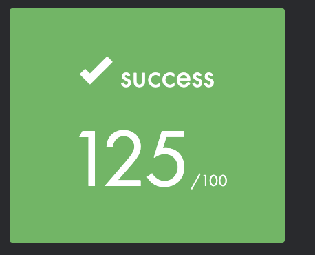

# 1337 (42 school)
## Get_Next_Line

This projects is about creating a function that, allows to read a line ending
with a newline character ('\\n') from a file descriptor, without knowing its
size beforehand. One of the goal of this project is to learn a highly
interesting new concept in C programming: static variables, and to gain a deeper
understanding of allocations, whether they happen on the stack memory or in the
heap memory, the manipulation and the life cycle of a buffer, the unexpected
complexity implied in the use of one or many static variables.
